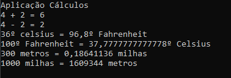

# Cálculos :1234:
Aplicação C# para efetuar diversos tipos de cálculos.

Desenvolvida no âmbito da ação de formação de **Introdução ao Git GitHub**

## Operações suportadas

Neste momento esta aplicação implementa as seguintes operações:
- soma
- subtração 
- conversão de temperaturas
    - Celsius :arrow_right: fahrenheit 
    - Fahrenheit :arrow_right: Celsius 
- conversão de distâncias
    - metros :arrow_right: milhas
    - milhas :arrow_right: metros
## Tecnologias utilizadas neste projeto

- Visual Studio
- C#
- Git
- GitHub Desktop
- Plataforma GitHub

